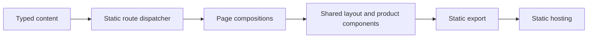

<!-- markdownlint-disable MD013 MD033 MD036 MD041 -->

<div align="center">


# Glyph website

**Independent software built for Qubic**

[](https://nextjs.org)
[](https://react.dev)
[](https://www.typescriptlang.org)
[](https://bun.sh)

Static export · Responsive · WCAG 2.2 AA target

[**Website**](https://glyphq.org) · [Documentation](https://docs.glyphq.org) · [GitHub](https://github.com/glyphq)

</div>

---

The public website for Glyph, an independent software organization building tools and applications for the Qubic network. The site documents the available product suite, planned ecosystem, developer path, maintenance model, roadmap, security information, and organization principles.

Glyph is an independent community project building software for the Qubic network. It is not an official Qubic organization.

## Site scope

**Organization**

- Mission, principles, maintenance model, and relationship to Qubic
- Product ecosystem and architecture
- Community, open-source, roadmap, and security information
- Brand and legal guidance

**Available products**

- Glyph Wallet
- Glyph Connect

**Planned or in-development products**

- Glyph Explorer
- Glyph SDK
- Glyph CLI
- Glyph Devkit
- Glyph API
- Glyph Docs
- Glyph Trade

**Implementation**

- Static Next.js App Router export
- Typed, centralized product and page content
- Shared product-page and organization-page components
- Light and dark themes using local Geist fonts
- Reduced-motion support and calm GSAP scroll reveals
- Per-route metadata, canonical URLs, Open Graph data, sitemap, and robots output
- Automated desktop and mobile screenshots, overflow checks, metadata checks, and accessibility audits

## Architecture

Product and organization truth lives in `content/`. Route components select reusable page compositions rather than duplicating product facts.



| Area | Responsibility |
| --- | --- |
| `app/` | App Router entry points, metadata, sitemap, robots, and global styles |
| `components/` | Global header, footer, UI primitives, diagrams, downloads, and motion |
| `components/layout/` | Page heroes, section headings, action groups, and page-level layout primitives |
| `components/pages/` | Homepage, ecosystem, organization, download, and supporting pages |
| `components/products/` | Product page framework, status, icons, diagrams, and related products |
| `content/` | Typed product records and non-product page content |
| `public/` | Brand assets, platform icons, social assets, manifest, and host redirects |
| `docs/` | Content audit, architecture, design decisions, and design-system notes |
| `scripts/` | Browser QA and screenshot capture |
| `artifacts/` | Generated screenshots and QA reports |

See [`docs/site-architecture.md`](./docs/site-architecture.md) for the current component and rendering model.

## Routes

| Group | Routes |
| --- | --- |
| Core | `/`, `/ecosystem`, `/developers`, `/community`, `/open-source`, `/roadmap`, `/security`, `/about` |
| Products | `/wallet`, `/connect`, `/explorer`, `/sdk`, `/cli`, `/devkit`, `/api`, `/docs`, `/trade` |
| Supporting | `/download`, `/brand`, `/privacy`, `/terms`, `/trademark`, `/404` |

Every public route includes a unique title, description, canonical URL, social metadata, one primary heading, responsive layout, and static output.

## Build locally

**Requirements:** [Bun](https://bun.sh) · a current Node.js-compatible environment

```sh
git clone https://github.com/glyphq/landing.git
cd landing
bun install
bun run dev
```

Open [http://localhost:3000](http://localhost:3000).

### Checks

```sh
bun run typecheck
bun run lint
bun run test
bun run build
```

`bun run test` runs the TypeScript and ESLint checks. `bun run build` generates the static site under `out/`.

### Browser QA

Install Playwright's Chromium browser once:

```sh
bunx playwright install chromium
```

Build the site, serve `out/` on port `4173`, then run the QA script:

```sh
bun run build
bunx serve out -l 4173
# In another terminal
bun run qa
```

The QA script visits every public route at `1440 × 900` and `390 × 844`. It checks response status, metadata, canonical URLs, heading count, console errors, and horizontal overflow. Desktop routes also run Axe checks against WCAG A and AA tags through WCAG 2.2.

Outputs are written to:

```text
artifacts/qa-report.json
artifacts/screenshots/desktop/
artifacts/screenshots/mobile/
```

## Stack

| Layer | Choice |
| --- | --- |
| Framework | Next.js 16 App Router |
| Interface | React 19 + TypeScript |
| Package manager | Bun |
| Styling | CSS variables, semantic tokens, and project CSS |
| Typography | Local Geist and Geist Mono packages |
| Motion | GSAP with reduced-motion fallbacks |
| Icons | Solar Icons React |
| Browser testing | Playwright |
| Accessibility testing | Axe Core for Playwright |
| Output | Static HTML export with trailing-slash routes |

## Content governance

Verified product facts are centralized in [`content/products.ts`](./content/products.ts). Non-product page copy is centralized in [`content/pages.ts`](./content/pages.ts).

Before changing product status, links, licenses, releases, package versions, or security claims:

1. Verify the information through a Glyph-owned repository, release, package, or documentation source.
2. Update the relevant typed content record.
3. Update [`docs/content-audit.md`](./docs/content-audit.md) when the source of truth changes.
4. Run the complete build and browser QA suite.

Planned products must remain clearly labeled. Do not add speculative availability dates, product capabilities, metrics, partnerships, audits, or affiliation claims.

## Design system

The site uses a predominantly monochrome system with OLED-oriented dark surfaces, warm neutral light surfaces, restrained radii, precise typography, and small icon-based details. Motion reveals structure without changing route navigation or hiding content when JavaScript is unavailable.

- Design decisions: [`docs/design-decisions.md`](./docs/design-decisions.md)
- Design system: [`docs/site-design-system.md`](./docs/site-design-system.md)
- Content audit: [`docs/content-audit.md`](./docs/content-audit.md)

## Static deployment

`next.config.ts` enables static export and trailing slashes:

```ts
const nextConfig = {
  output: "export",
  trailingSlash: true,
};
```

Deploy the generated `out/` directory to a static host. [`public/_redirects`](./public/_redirects) provides the current static-host fallback behavior. The deployment must preserve physical route directories, redirects, sitemap output, robots output, and social assets.

## Contributing

1. Create a focused branch.
2. Keep product truth in the typed content layer.
3. Reuse existing page, product, and layout components before creating new patterns.
4. Preserve keyboard access, reduced-motion behavior, light and dark themes, and mobile layouts.
5. Run all checks and browser QA.
6. Commit updated route screenshots when a visual change is intentional.

Security issues should not be opened as public bug reports. Follow the reporting instructions on [glyphq.org/security](https://glyphq.org/security/).

## Community

- **Website:** [glyphq.org](https://glyphq.org)
- **GitHub:** [github.com/glyphq](https://github.com/glyphq)
- **Documentation:** [docs.glyphq.org](https://docs.glyphq.org)
- **Brand:** [branding.glyphq.org](https://branding.glyphq.org)

## License

This repository does not currently include a published license file. Do not assume that the website code or content is open source until explicit license terms are added.
